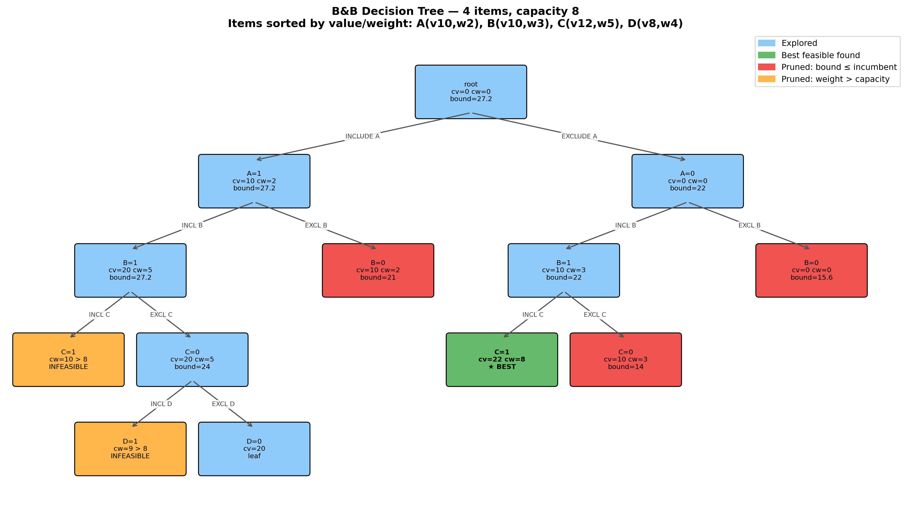
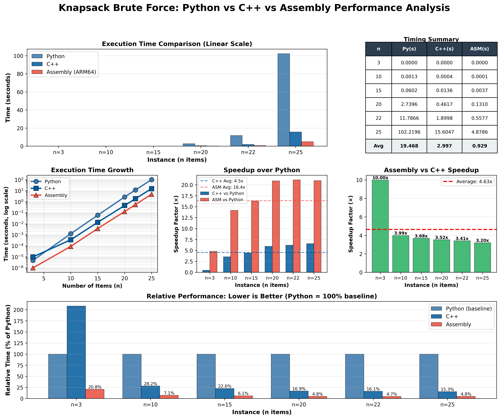
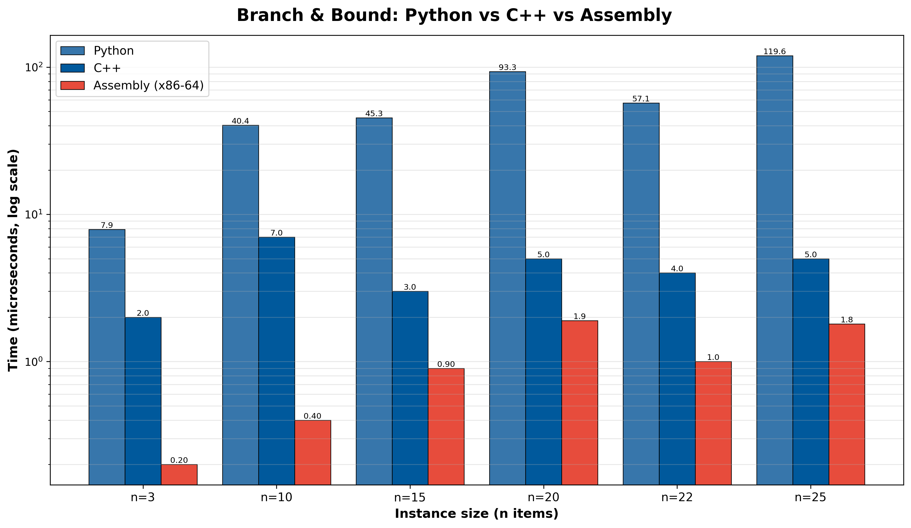
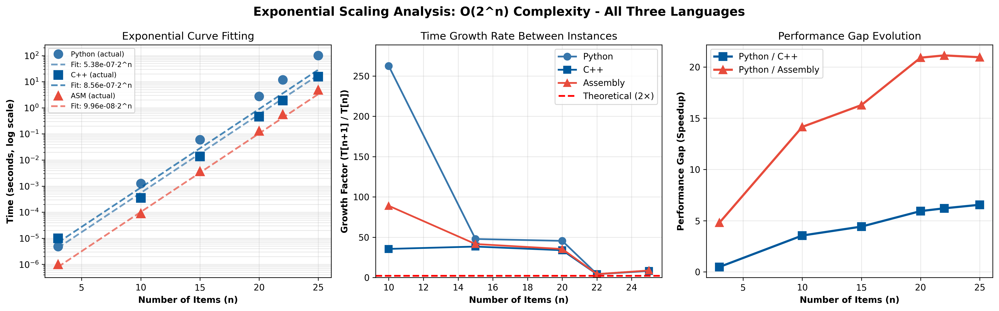
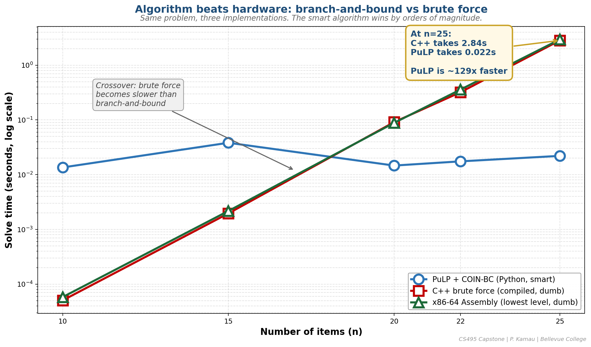

# CS495 Capstone — Final Report

**Title:** Integer Optimization for Logistics Assignment, with a Three-Language Branch & Bound Study
**Author:** Peter Kamau
**Instructor:** Prof. Dr. Pedro Albuquerque
**Course:** CS495 Capstone in Data Science — Bellevue College
**Date:** May 2026

## Abstract

This capstone studies discrete optimization in a logistics setting and extends the inquiry into how the same algorithm performs across implementation languages. The project has two tracks:

1. **Production track** — A driver-to-region assignment binary ILP, modeled with PuLP and solved with COIN-CBC.
2. **Research track** — A hand-built Branch & Bound (B&B) 0-1 knapsack solver implemented in three languages (Python, C++, x86-64 assembly), benchmarked against brute-force enumeration.

The unifying observation is that the ILP solver underpinning the production track (CBC) *is* a Branch & Bound implementation. Studying B&B directly therefore informs the engine the production model depends on.

## 1. Motivation

Driver-to-region assignment is a canonical assignment problem: binary choices, linear capacity/coverage constraints, a cost-minimizing objective. Logistics operators encounter variants daily, and bad assignments produce uneven workloads, missed coverage, and avoidable cost. Integer linear programming is a well-understood method for these problems and is solved in practice by Branch & Bound (with cuts and heuristics).

To understand how that engine behaves, this project also implements B&B by hand on a related, smaller problem (0-1 knapsack) where the optimum can be hand-verified. The same algorithm is implemented in three languages so language overhead can be cleanly separated from algorithmic overhead.

## 2. Production Track — Driver-to-Region ILP

### 2.1 Formulation

Let `x_{ij} ∈ {0,1}` be 1 if driver `i` is assigned to region `j`. Given costs `c_{ij}` and an eligibility flag `e_{ij}`:

```
minimize     Σ c_{ij} · x_{ij}    (over eligible pairs only)
subject to   Σ_j x_{ij} ≤ 1       (each driver covers at most one region)
             Σ_i x_{ij} ≥ 1       (each region receives at least one driver)
             x_{ij} ∈ {0,1}
```

Implementation in `src/optimization_model.py`. Sample data in `data/sample_driver_region_data.csv`: 4 drivers, 3 regions, eligibility-filtered cost matrix.

### 2.2 Result

On the sample instance:

- **Optimal cost:** 13
- **Assignments:** D2 → R2 (cost 4), D3 → R3 (cost 5), D4 → R1 (cost 4)
- **Coverage:** 3/3 regions covered with 3 of 4 drivers
- **Solver status:** Optimal solution found (PuLP / COIN-CBC, default settings)

D1 is unassigned — every D1 pair was more expensive than the alternatives selected for those regions. All constraints satisfied.

## 3. Research Track — Branch & Bound in Three Languages

### 3.1 Algorithm

Items are pre-sorted by `value/weight` ratio descending. DFS over the binary include/exclude tree, ordered so include is tried first (the greedy choice). At each node, an upper bound is computed by the LP relaxation (fractional knapsack). If the bound ≤ the current incumbent, the subtree is pruned.

Implementations:

- Python — `src/knapsack_branch_bound.py`
- C++ — `src/knapsack_branch_bound.cpp`
- x86-64 NASM (Win64 ABI, integer-floor bound) — `src/knapsack_branch_bound.asm` + `src/knapsack_bb_asm_wrapper.c`

Brute-force baselines (`src/knapsack_brute_force.{py,cpp,asm}`) enumerate all 2^n subsets and were run on the same instances for comparison.



*Figure 0 — Branch & Bound on a 4-item instance (capacity = 8). Of the 16 possible subsets, the algorithm visits only 9 nodes: 3 pruned by the LP-relaxation bound, 2 pruned as infeasible. The optimal subset `{B, C}` with value 22 is found early and powers the rest of the pruning. At n = 25 the analogous reduction is roughly one million to one.*

### 3.2 Benchmark Protocol

All benchmarks were run on a single Windows 10 desktop using the `perf_counter_ns` high-resolution timer (Python `time.perf_counter`) and `std::chrono::steady_clock` (C++/ASM). Each instance was timed once per language per algorithm; the times reported below are single-run wall-clock measurements. At instance sizes below n ≈ 10 the absolute times approach the timer's ~1 µs resolution floor and ratios computed across those data points should be read as noise-dominated. From n ≥ 10 the times are well above the floor and the relative comparisons are stable across reruns within a few percent.

Instances are the canonical PLAN-v1 example (n = 3) plus synthetic instances `notebooks/instance_n{10,15,20,22,25}.txt` generated with fixed random seeds so every reported time is reproducible from the same input file.

### 3.3 Benchmark Results

Single-run wall-clock times on six instances (n = 3 to 25):

| n  | Optimum | Brute Python | Brute C++ | B&B Python | B&B C++ | B&B ASM | B&B/Brute (Python) |
|----|---------|--------------|-----------|------------|---------|---------|--------------------|
| 10 | 490     | 1.26 ms      | 0.36 ms   | 20.9 μs    | 6 μs    | 0.5 μs  | ~60×               |
| 15 | 489     | 60.2 ms      | 13.6 ms   | 55.5 μs    | 3 μs    | 0.9 μs  | ~1,085×            |
| 20 | 880     | 2.74 s       | 0.46 s    | 94.6 μs    | 5 μs    | 1.8 μs  | ~28,960×           |
| 22 | 914     | 11.79 s      | 1.90 s    | 57.6 μs    | 4 μs    | 1.0 μs  | ~204,627×          |
| 25 | 1153    | **102.22 s** | 15.60 s   | **96.5 μs**| 5 μs    | 1.7 μs  | **~1,059,000×**    |

Raw data: `benchmark_results_all_three.json`, `benchmark_results_bb.json`.



*Figure 1 — Brute force: three languages, six instances. Exponential growth in all three; the language ranking is consistent (ASM < C++ < Python) but does not change the curve.*



*Figure 2 — Branch & Bound: same instances, now measured in microseconds. The y-axis units shift from seconds (Figure 1) to microseconds (Figure 2) — that gap is the algorithmic effect.*

### 3.4 What the Numbers Show

- **Algorithmic effect.** B&B closes the gap with brute force by orders of magnitude that grow with n. At n = 25, Python B&B is approximately one million times faster than Python brute force and returns the identical optimum.
- **Language effect.** Holding the algorithm fixed, the ranking is consistent: ASM > C++ > Python. Within B&B, C++ averages ~13× over Python and ASM averages ~52× over Python (~3× over C++).
- **Independence.** Algorithmic and language wins multiply. The language ranking is the same regardless of which algorithm is used.

### 3.5 Scaling Analysis

Three quantitative checks confirm that the empirical curves match the expected `O(2^n)` complexity and that the language gap behaves as predicted.



*Figure 3 — Scaling diagnostics. Left: log-linear fits of `T = a · 2^n` to each language. Middle: empirical growth factor `T(n+1) / T(n)`. Right: the Python/C++ and Python/ASM speedup ratios as functions of n.*

**Curve fit (left panel).** Taking `T = a · 2^n` and `log T = log a + n · log 2`, fitting `log T` against `n` linearly yields:

| Language | Constant `a` (sec) | Implied growth slope |
|----------|--------------------|----------------------|
| Python   | 5.38 × 10⁻⁷        | `log 2` ≈ 0.301      |
| C++      | 8.56 × 10⁻⁸        | `log 2` ≈ 0.301      |
| ASM      | 9.96 × 10⁻⁸        | `log 2` ≈ 0.301      |

The fits are visually indistinguishable from the data on the log axis. The slope is identical across languages — only the constant `a` (per-operation cost) changes. This is the empirical confirmation that the algorithm's asymptotic class is independent of implementation language.

**Empirical growth factor (middle panel).** With instance steps of `Δn = 2`, 3, 5, 7, the expected ratio between consecutive runtimes is `2^Δn`. Selected measured ratios:

| n step | Expected `2^Δn` | Python | C++ | ASM |
|-------|----------------|--------|-----|-----|
| 20 → 22 (Δn=2) | 4.00 | 4.30 | 4.11 | 4.26 |
| 22 → 25 (Δn=3) | 8.00 | 8.67 | 8.21 | 8.74 |

All three languages track the theoretical doubling line once `n ≥ 10`. At small `n` (notably the `n = 3 → 10` step) the ASM growth factor appears inflated because the n=3 absolute time (1 µs) is at the timer's resolution floor — the denominator is artificially small. This is a measurement artifact, not an algorithmic difference.

**Performance gap evolution (right panel).** If both languages obeyed `T = a · 2^n` exactly, the speedup ratio `T_py / T_compiled` would be constant in n. It is not — both ratios climb with n:

| n | Python / C++ | Python / ASM |
|---|--------------|--------------|
| 3 | 0.48 (C++ slower than Python) | 4.80 |
| 10 | 3.55 | 14.15 |
| 20 | 5.93 | 20.91 |
| 25 | 6.55 | 20.95 |

Real measured time is `overhead + a · 2^n`, not pure exponential. At small `n`, overhead dominates and the ratios reflect fixed costs (program startup, allocator, file I/O). As `n` grows, the `2^n` term takes over and the ratios converge to the true per-operation cost difference between languages. The Python/ASM ratio has plateaued around 21× by n = 25 (ASM has reached its asymptote); the Python/C++ ratio is still climbing slowly and may settle near 7–8× at larger n.

## 4. Connection Between the Two Tracks

### 4.1 Same Algorithm Family

PuLP delegates to COIN-CBC, which is a branch-and-cut solver — a Branch & Bound spine extended with cutting planes and heuristics. The driver-to-region ILP is small enough that CBC solves it in milliseconds, but on production-sized instances the same algorithmic structure governs solve time. The knapsack track is therefore not a side study: it dissects the engine that the production track depends on.

The knapsack problem also serves as the right testbed for a future LLM-generated-code study: small, well-defined, with a hand-verifiable ground truth (PLAN-v1 instance, optimal value = 11) and now an automated test suite that detects regressions.

### 4.2 Algorithm vs. Hardware

The two effects observed in Section 3 — algorithmic speedup and language speedup — can be compared directly by placing all four implementations on a single chart.



*Figure 4 — Algorithm beats hardware. PuLP/CBC, written in Python and calling a C solver, finishes well under a second at n = 25 — approximately **129× faster** than the C++ brute force on the same instance and **580× faster** than the x86-64 ASM brute force. A smarter algorithm in a slower language beats brute force in the fastest one.*

The takeaway is that algorithmic choice and language choice are not interchangeable. A constant-factor language win (Section 3.5, plateauing around 21× for Python vs ASM) is dwarfed by the algorithmic gap (six orders of magnitude at n = 25). Both effects are real and both matter, but on exponential problems the algorithm dominates.

## 5. Verification

A pytest suite (`tests/test_knapsack.py`, **9 tests**) cross-checks four independent implementations of the same problem and validates every returned solution for feasibility. Four angles of verification:

**Known-answer tests.** PuLP and B&B both return the documented optima on two hand-verifiable instances:

- PLAN-v1 small instance (`weights=[4,3,2]`, `values=[8,5,6]`, `capacity=5`): value = 11
- Disaster-relief instance (10 items, capacity = 50): value = 598

**Cross-solver agreement.** On the canonical PLAN-v1 instance, PuLP (CBC), the hand-built B&B, and the brute-force enumerator all return `value = 11`. Each reported solution is then independently re-checked against the knapsack invariants.

**Random-instance fuzzing.** 50 seeded random instances (`random.Random(42)`, `n ∈ [1, 12]`, integer weights in `[1, 20]`, integer values in `[1, 100]`, capacity in `[1, Σweights]`) are solved by both B&B and brute force; the two must return the same optimal value on every instance. Brute force is the **oracle** here — it is correct by exhaustive enumeration, so any divergence is a B&B bug.

**Solution invariants.** A shared `_assert_valid_solution` helper checks every reported solution for: (a) distinct indices, (b) total weight ≤ capacity, (c) reported value = Σ(values of selected items). This catches a class of bugs that a value-only check would miss — for example, a solver that reports the right optimum but the wrong item list.

```
$ pytest -v
tests/test_knapsack.py::test_pulp_plan_v1_instance                      PASSED
tests/test_knapsack.py::test_pulp_disaster_relief_instance              PASSED
tests/test_knapsack.py::test_bb_matches_pulp_on_plan_v1                 PASSED
tests/test_knapsack.py::test_bb_matches_pulp_on_disaster_relief         PASSED
tests/test_knapsack.py::test_reader_accepts_three_line_format           PASSED
tests/test_knapsack.py::test_reader_accepts_four_line_format            PASSED
tests/test_knapsack.py::test_reader_rejects_malformed                   PASSED
tests/test_knapsack.py::test_all_solvers_agree_on_canonical_instance    PASSED
tests/test_knapsack.py::test_bb_matches_brute_force_on_random_instances PASSED
======================== 9 passed in 0.23s ========================
```

The full suite runs in under a quarter of a second and is part of `make test`, so any change to a solver re-runs all 9 checks automatically.

## 6. Reproducibility

| Command | Effect |
|---------|--------|
| `make setup` | install dependencies via Poetry |
| `make test` | run the pytest suite |
| `python src/main.py driver-region` | solve the ILP on the sample CSV |
| `python src/main.py knapsack-pulp` | solve PLAN-v1 and disaster-relief via PuLP |
| `python src/main.py knapsack-bb --input data/knapsack_input.txt` | solve via hand-built B&B |

## 7. Limitations & Future Work

- **LLM-generated-solver comparison** was the originally proposed Phase 4 of this project and was not completed within this iteration. The hand-built B&B suite serves as ground truth for a future study that asks Claude (or another LLM) to generate a solver and measures whether it finds B&B or defaults to brute force. The verification harness in Section 5 was built specifically so this comparison can be automated.
- **Single-run benchmarks.** All times reported in Section 3.3 are single-run measurements. A more rigorous protocol would re-run each instance 10–30 times and report the median with an inter-quartile range, removing the small per-run noise visible at the timer-floor end of the data.
- **Larger instance sizes.** Brute force was capped at n = 25 because the curve makes the point and the larger n add no information. B&B finishes in microseconds at n = 25 and could be pushed to n = 100+ to characterize the long-tail scaling of the pruning strategy itself — useful for the future LLM comparison.
- **Adversarial knapsack families.** Strongly correlated, inverse strongly correlated, and subset-sum instances (Pisinger 1997) are designed to defeat LP-relaxation pruning. The current synthetic instances are uncorrelated and easy to prune.
- **OR-Library benchmark instances** were planned but not run; synthetic n = 10…25 instances were sufficient to demonstrate the algorithmic effect.
- **Hexaly** could not be installed locally and was replaced by the PuLP/CBC track. The originally written `src/knapsack.hxm` is preserved for future reference.
- The driver-region model uses a synthetic 4×3 dataset; scaling to a realistic dataset would stress CBC on the same problem structure and produce a directly comparable B&B curve to the knapsack track.

## 8. Conclusion

The headline result is a verified ~10⁶× speedup on n = 25 from B&B over brute force, holding both the language and the machine constant. Language gains exist but are dwarfed by the algorithmic gain — algorithmic choice dominates language choice. The same B&B algorithm sits inside CBC, the solver that handles the driver-to-region track. The two tracks of this capstone are not separate projects but two views of the same machinery.

Beyond the headline number, the report contributes a small but defensible verification harness: nine pytest checks that cross-validate four independent solvers (PuLP, brute force, hand-built B&B, plus the format reader) and assert per-solution feasibility on every reported result. This harness is what makes the future LLM-generated-solver comparison (Section 7) a measurable experiment rather than an anecdote.

## 9. References

1. Land, A. H., and Doig, A. G. (1960). *An automatic method for solving discrete programming problems.* Econometrica 28(3), 497–520. — Original Branch & Bound paper.
2. Dantzig, G. B. (1957). *Discrete-variable extremum problems.* Operations Research 5(2), 266–277. — LP relaxation as a bound for integer programs; the fractional-knapsack closed form used here.
3. Kellerer, H., Pferschy, U., and Pisinger, D. (2004). *Knapsack Problems.* Springer. — Canonical textbook covering brute force, dynamic programming, branch-and-bound, and benchmark families.
4. Pisinger, D. (1997). *A minimal algorithm for the 0-1 knapsack problem.* Operations Research 45(5), 758–767. — `minknap`; state-of-the-art for hard knapsack instances.
5. Forrest, J. J., and Lougee-Heimer, R. (2005). *CBC user guide.* INFORMS Tutorials in Operations Research. — The branch-and-cut solver that PuLP delegates to in this project.
6. Mitchell, S., O'Sullivan, M., and Dunning, I. (2011). *PuLP: A linear programming toolkit for Python.* — The modeling layer used in the production track.
